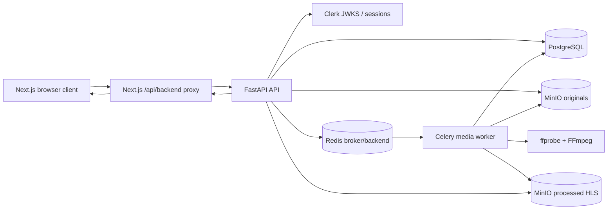
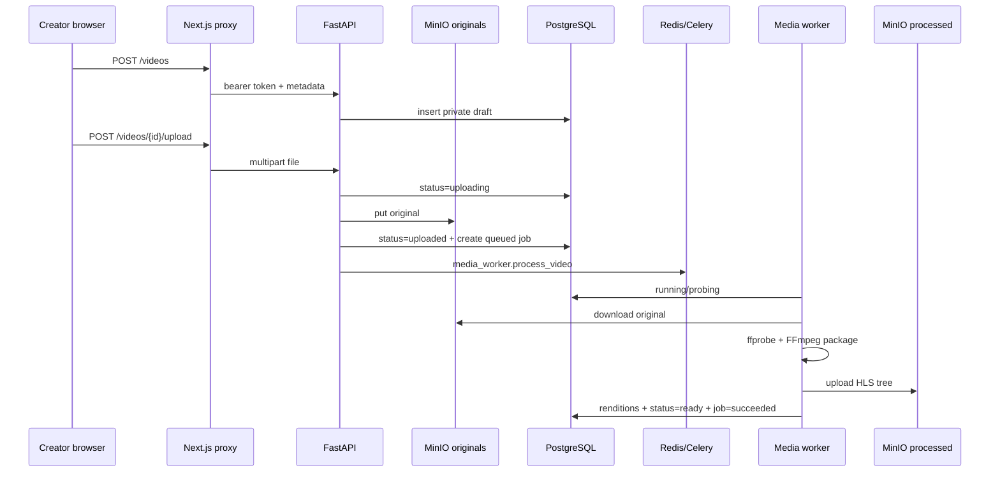
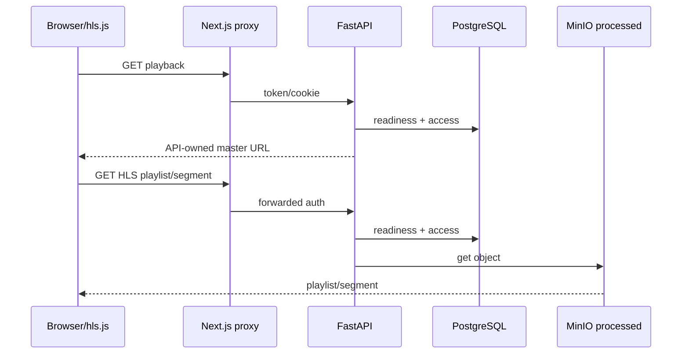

# Atlas Prime — Product Specification and Engineering Handbook

Document version: 1.1
Last updated: 2026-08-04
Generated or audited by: repository handbook synchronization agent
Repository: `Zburgers/Atlas-Prime`
Authoritative branch: `main`
Verified branch commit: `dcf8d5cd3d18bb29dccb70dbce44405043a8adcb`
Current authoritative branch commit after handbook merge: `8d0ebc5f7c08d66c2d5edbe910c1aee740bed9b3`
Reconciled candidate branch: `docs/fullplatform-rollout`
Reconciliation base commit before version 1.1 documentation: `65e23a0697091916f84b4b3b64953372730c7998`
Production status: `UNVERIFIED`
Verified deployed commit: `UNVERIFIED`
Deployment verification: no production URL, release artifact, deployed revision endpoint, image digest, or authorized runtime evidence was found
Document confidence: `HIGH` for repository implementation; `LOW` for deployed runtime
Confidentiality: repository-internal engineering documentation; contains no secret values

## Document contract

This handbook is the rolling product and engineering source of truth for Atlas Prime.

Precedence is intentionally split:

1. `docs/00-ground-truth-mvp-spec.md` remains the narrow normative authority for approved MVP scope and locked stack choices.
2. Part I of this handbook reconciles that approved scope with current product decisions, implementation gaps, and dependency-ordered remediation.
3. Part II describes implementation reality at the verified branch commit.
4. `docs/sectors/*.md` remain implementation manifests for their specific sectors.
5. `memory/*.md` remains the chronological handoff and ADR trail.
6. When this handbook conflicts with executable code about what exists, code and tests win descriptively.
7. When executable code conflicts with the ground-truth MVP specification about what should happen, the contradiction is recorded as `⚠️ CHANGE`, `❌ REMOVE`, or an open ruling.

Status tags:

- `✅ SHIPPED` — implemented on the authoritative branch at the intended MVP boundary.
- `⚠️ CHANGE` — implemented behavior exists but contradicts an approved rule or lacks required reliability/security semantics.
- `🔨 BUILD` — approved behavior is absent.
- `❌ REMOVE` — behavior, exposure, copy, or interface must be retired.
- `💡 CANDIDATE — NOT APPROVED` — potentially useful future work that must not be treated as committed scope.

Evidence levels:

- `E1` runtime verified at an attributable deployed revision.
- `E2` integrated implementation with meaningful tests or recorded end-to-end smoke validation.
- `E3` reachable implementation on the authoritative branch.
- `E4` partial implementation or incomplete wiring.
- `E5` documentary/planning evidence only.
- `E0` implementation contradicts the documented requirement.

No current feature is classified `E1`; production is unverified.

## 2026-08-04 rollout-branch reconciliation addendum

PR #11 established this handbook from `main` implementation commit `dcf8d5c` and was merged to `main` as documentation-only commit `8d0ebc5`. The `docs/fullplatform-rollout` branch has a much newer post-MVP implementation lineage through `4f0e98d`; merge commit `65e23a0` combines that lineage with the handbook. Consequently, the original finding text remains valid evidence for its named `main` commit but is not a current-state queue for the rollout branch.

The rollout branch resolves or partially resolves several original findings:

| Change | Reconciled branch state | Evidence summary |
|---|---|---|
| C-001 admin authorization | PARTIAL | FastAPI admin routes use `AdminUserDep` backed by `ATLAS_ADMIN_CLERK_USER_IDS`; API regression coverage is green at `bac7a89`, while the Next proxy remains transport-only and has no independent role gate |
| C-002 unlisted discovery | RESOLVED | `list_visible_videos()` exposes only ready, public, moderation-approved videos to non-owners |
| C-003 response internals | RESOLVED | product schemas redact storage keys/task IDs and explicit operator debug schemas retain them; API/frontend coverage is green at `fd62a20` and `d79b42f` |
| C-004 upload idempotency | OPEN | upload remains read-then-write and accepts `uploading` as a starting state |
| C-005 attempt ownership | PARTIAL | worker atomically claims queued job/video, but no generation lease or stale-finalization fence exists |
| C-006 atomic publication | PARTIAL | partial HLS cleanup exists; uploads still target a shared deterministic prefix |
| C-007 deletion cleanup | PARTIAL | synchronous original/processed object cleanup exists; durable retry semantics are absent |
| C-008 active-worker deletion fence | OPEN | no tombstone/generation guard prevents post-delete recreation |
| C-009 segment binding | OPEN | patterned segment paths are accepted without published inventory binding |
| C-010 telemetry governance | OPEN | no admission rate, event dedupe identity, or retention job |
| C-011 strict `azp` | RESOLVED | configured authorized-party allowlists reject missing/mismatched `azp` and normalize matching values; tests are green at `ced7472` |
| C-012 stale watch copy | RESOLVED | watch UI uses user-safe lifecycle guidance and regression coverage removes sector-internal copy at `d33d456` |

The branch also delivers post-MVP product slices absent from the original `main` audit, including channels/discovery, reactions/saves, Studio, comments, deterministic feeds and diagnostics, thumbnails, moderation, analytics, captions, subscriptions/history, playlists, richer playback events, expanded media outputs, chapters/timeline, signed redirect delivery, Meilisearch, accessibility verification, and caption transcript search.

The canonical live queue is `docs/plans/README.md`. Its five indexed plans replace the broad phase allocation below with sequential task IDs, exact files, commands, expected results, entry gates, and stop conditions. Post-MVP Recommendation V2/ML work is deferred until that hardening and release-evidence sequence passes and the owner explicitly approves further scope.

---

# Part I — Normative Product Specification

## 1. Product definition

Atlas Prime is a learning-oriented, self-hostable video-on-demand platform. Its approved MVP proves one complete loop:

```text
Clerk-backed user identity
→ private video metadata record
→ API-mediated media upload
→ private MinIO original object
→ durable Celery processing job
→ ffprobe inspection and FFmpeg HLS packaging
→ ready video with renditions and thumbnail
→ API-authorized HLS playback in a browser
→ operator-visible state, failures, and playback events
```

### Primary users

- **Visitor:** may list and watch ready public videos; may use an unlisted link but must not discover unlisted videos through public listing.
- **Authenticated creator/owner:** may create, upload, inspect, update, delete, and watch owned videos.
- **Operator/admin:** intended to inspect global worker, queue, job, video, failure, and playback-event state. The role is product-intended but not yet represented or enforced in code.

### Value proposition

The product teaches a real VOD architecture without introducing live streaming, DRM, payments, recommendations, GPU processing, Kubernetes, or multi-region distribution before the single-node loop is reliable.

### Explicit MVP non-goals

Live streaming; DRM; paid access; subscriptions; advertisements; creator payouts; recommendations; comments; social feed; mobile clients; GPU transcoding; distributed autoscaling; multi-region delivery; advanced moderation; full subtitle generation; and public search.

## 2. Actors, roles, and identity

### 2.1 Visitor

Capabilities:

- List ready public videos.
- Open a ready public video.
- Open a ready unlisted video when given its URL.
- Fetch authorized playback metadata and HLS objects for public/unlisted video.
- Submit playback telemetry for readable video under the current implementation.

Restrictions:

- Must not list unlisted videos.
- Must not access private or non-ready video.
- Must not mutate any video.
- Must not access operator data.

### 2.2 Authenticated creator

Identity source: Clerk session JWT verified by FastAPI.

Capabilities:

- `GET /me`
- Create a private draft.
- List owned videos plus publicly discoverable videos.
- Read owned video in every lifecycle state.
- Update title, description, and privacy.
- Upload a supported original media file.
- Queue processing when state permits.
- View processing status and failure details.
- Watch owned ready private video.
- Delete an owned database video record.

Restrictions:

- Server-side ownership checks must protect every mutation and private read.
- Creator responses must not expose internal object-storage keys or queue implementation identifiers as public API contracts.
- Delete must not claim completion while retained media or active processing can recreate data.

### 2.3 Operator/admin

Target capabilities:

- Inspect worker and queue health.
- List global videos and processing jobs.
- Inspect failures, renditions, and recent playback events.
- Perform future recovery actions only through explicit, audited controls.

Current state:

- No admin role, claim, allowlist, or database capability exists.
- Every authenticated user currently satisfies the API dependency used by `/admin/*`.
- This is not a valid admin authorization model.

### Capability matrix

| Capability | Visitor | Creator/owner | Other signed-in creator | Operator/admin target |
|---|---:|---:|---:|---:|
| List public ready videos | Yes | Yes | Yes | Yes |
| Discover unlisted video in listing | No | Only if owned | No | Yes |
| Read public/unlisted ready video by ID | Yes | Yes | Yes | Yes |
| Read private video | No | Yes | No | Yes, audited |
| Create/upload video | No | Yes | Yes, own only | Optional |
| Update/delete video | No | Yes | No | Explicit audited override only |
| Read processing status | Public/unlisted ready only | Yes | Public/unlisted ready only | Yes |
| Read global jobs/videos/events | No | No | No | Yes |
| Inspect worker/queue health | No | No | No | Yes |

## 3. Product surfaces and navigation

| Surface | Current route/interface | Status | Notes |
|---|---|---|---|
| Video library | `/` | ✅ SHIPPED | Client-rendered list and status display |
| Upload | `/upload` | ✅ SHIPPED | Creates metadata then performs multipart upload |
| Watch/status | `/watch/{videoId}` | ✅ SHIPPED | Poll-by-refresh status and HLS playback |
| Operator dashboard | `/admin` | ⚠️ CHANGE | Reachable by any signed-in user |
| API documentation | `/docs` | ✅ SHIPPED | FastAPI-generated local surface |
| Health | `/healthz/live`, `/healthz` | ✅ SHIPPED | Liveness and dependency checks |
| Backend proxy | `/api/backend/{path}` | ⚠️ CHANGE | Generic proxy; no admin-path policy |
| Public discovery | `GET /videos` | ⚠️ CHANGE | Incorrectly includes unlisted ready videos |

Navigation must remain honest. Internal implementation language such as “D/E still own HLS generation” must not appear in the end-user watch experience after HLS is implemented.

## 4. Core domain workflows

### 4.1 Clerk identity and local user synchronization ✅ SHIPPED

**Implementation completeness:** FULL
**Runtime state:** UNVERIFIED
**Evidence strength:** E2
**Confidence:** HIGH

**Actors:** authenticated creator.
**Preconditions:** Clerk issuer/JWKS configuration or explicitly enabled local smoke headers.
**Happy path:** bearer token or `__session` cookie is verified; `sub` maps to `users.clerk_user_id`; the user row is created or updated.
**Authorization:** API dependencies enforce identity before protected routes.
**Failure paths:** missing token returns 401; auth configuration failure returns a sanitized 500; invalid token returns 401.
**Evidence:** `apps/api/app/services/auth.py`, `apps/api/app/api/deps.py`, `apps/api/app/services/users.py`, `apps/api/tests/test_video_api.py`.
**Known gap:** configured authorized parties do not require the `azp` claim to be present.

### 4.2 Video metadata lifecycle ✅ SHIPPED

**Implementation completeness:** FULL
**Runtime state:** UNVERIFIED
**Evidence strength:** E2
**Confidence:** HIGH

Creators can create private drafts, list visible videos, read owned videos, patch title/description/privacy, inspect processing status, and delete the database row.

The canonical states are:

```text
draft → uploading → uploaded → queued → probing → processing → ready
                                    ↘ failed
```

**Evidence:** `apps/api/app/domain/status.py`, `apps/api/app/services/videos.py`, `apps/api/app/db/models.py`, migration `20260628_0001_core_video_domain.py`.

**Known contradictions:**

- Unlisted ready videos are included in anonymous/global listing.
- Delete removes only database state and does not implement authoritative media deletion.

### 4.3 Original upload and queue dispatch ✅ SHIPPED

**Implementation completeness:** FULL with reliability gaps
**Runtime state:** UNVERIFIED
**Evidence strength:** E2
**Confidence:** HIGH

**Actors:** owner only.
**Preconditions:** video status is `draft`, `uploading`, or `failed` under current code; supported extension/content type; size within `ATLAS_UPLOAD_MAX_BYTES`; lightweight container signature matches.
**Happy path:** upload is buffered, written to `originals/{video_id}/source.{ext}`, video advances to `uploaded`, job row is created, Celery task `media_worker.process_video` is dispatched, and video advances to `queued`.
**Failure paths:** validation or storage/queue failure marks the video `failed` with sanitized details.
**Evidence:** `apps/api/app/services/uploads.py`, `apps/api/app/services/storage.py`, `apps/api/app/services/processing_queue.py`, `scripts/smoke-devex.sh`.

**Required change:** exactly one upload attempt must own a video transition; duplicate/concurrent upload requests must be rejected or idempotently coalesced.

### 4.4 Media processing and HLS packaging ✅ SHIPPED

**Implementation completeness:** FULL with reliability gaps
**Runtime state:** UNVERIFIED
**Evidence strength:** E2
**Confidence:** HIGH

**Actors:** durable Celery worker.
**Preconditions:** original object, queued job, PostgreSQL, Redis, MinIO, ffprobe, FFmpeg.
**Happy path:** worker marks job running/video probing, downloads original, probes metadata, marks processing, produces rendition playlists/segments/master/thumbnail, uploads processed objects, replaces rendition rows, marks video ready, and marks job succeeded.
**Evidence:** `workers/media/media_worker/celery_app.py`, `packager.py`, `repository.py`, `storage.py`, `workers/media/tests/test_packager.py`.

**Required changes:** attempt ownership/lease, compare-and-set transitions, bounded retry/recovery, attempt-specific output staging, cleanup on partial failure, and deletion fencing.

### 4.5 Playback metadata and HLS proxy ✅ SHIPPED

**Implementation completeness:** FULL with authorization-integrity gap
**Runtime state:** UNVERIFIED
**Evidence strength:** E2
**Confidence:** HIGH

The browser obtains API-owned playback URLs from `GET /videos/{id}/playback`; hls.js or native HLS uses the same-origin Next.js proxy; FastAPI rechecks readiness and viewer access before reading MinIO objects.

**Evidence:** `apps/api/app/api/videos.py`, `apps/api/app/services/videos.py`, `apps/api/app/services/storage.py`, `apps/web/app/watch/[videoId]/watch-client.tsx`, `apps/web/app/api/backend/[...path]/route.ts`.

**Required change:** a segment request must be bound to a generated manifest, persisted segment inventory, or immutable generation-specific prefix—not merely a filename pattern.

### 4.6 Browser creator workflow ✅ SHIPPED

**Implementation completeness:** FULL for MVP loop
**Runtime state:** UNVERIFIED
**Evidence strength:** E2
**Confidence:** HIGH

The web app exposes library, upload, status/watch, HLS playback, and local API status. Upload progress is phase-level rather than byte-level. Processing refresh is manual rather than automatic polling.

**Evidence:** `apps/web/app/page.tsx`, `components/video-list.tsx`, `upload/upload-form.tsx`, `watch/[videoId]/watch-client.tsx`.

### 4.7 Playback telemetry ✅ SHIPPED

**Implementation completeness:** FULL ingestion, PARTIAL governance
**Runtime state:** UNVERIFIED
**Evidence strength:** E2
**Confidence:** HIGH

Readable videos accept player-ready, play, pause, error, unsupported, buffering, and quality-change events. The watch client treats telemetry as non-blocking.

**Required change:** introduce abuse controls, deduplication/session identity, aggregation strategy, and retention.

### 4.8 Operator observability portal ⚠️ CHANGE

**Implementation completeness:** FULL surface, INVALID authorization boundary
**Runtime state:** UNVERIFIED
**Evidence strength:** E0 against “admin protected” documentation
**Confidence:** HIGH

**Current behavior:** any valid authenticated user can call `/admin/ops`, `/admin/videos`, `/admin/jobs`, and `/admin/videos/{id}/debug`; `/admin` is client-gated only by sign-in.
**Target behavior:** only a defined operator/admin principal may access global operational data; enforcement must exist in FastAPI and at the Next.js route/proxy boundary.
**Evidence:** `apps/api/app/api/admin.py`, `apps/web/app/admin/page.tsx`, `apps/web/app/admin/admin-dashboard.tsx`, generic proxy route.

### 4.9 Local stack, tests, and vertical smoke ✅ SHIPPED

**Implementation completeness:** FULL local harness
**Runtime state:** historically validated; current HEAD rerun UNVERIFIED
**Evidence strength:** E2
**Confidence:** HIGH

`compose.yaml`, `Makefile`, `.env.example`, Dockerfiles, pytest suites, Node tests, worker tests, and `scripts/smoke-devex.sh` implement a clean local path.

The latest recorded handoff states:

- API: 28 tests passed.
- Worker: 2 tests passed.
- Web: 1 Node test passed.
- `make lint` passed.
- `make smoke` completed upload → ready playback and corrupt upload → failed.

That validation is recorded for 2026-06-29. It was not rerun during this documentation-only synchronization.

## 5. Visibility and permission matrix

| Resource/action | Anonymous | Authenticated owner | Authenticated non-owner | Operator target |
|---|---:|---:|---:|---:|
| List ready public video | Allow | Allow | Allow | Allow |
| List ready unlisted video | Deny discovery | Allow if owner | Deny discovery | Allow |
| Read ready public/unlisted by ID | Allow | Allow | Allow | Allow |
| Read private or non-ready | Deny | Allow | Deny | Allow, audited |
| Create video | Deny | Allow | Allow for own account | Optional |
| Upload/process/update/delete | Deny | Allow own | Deny | Explicit override only |
| HLS object | Same as video read | Allow own | Public/unlisted only | Allow |
| Submit playback event | Readable video only, rate limited | Readable video | Readable video | N/A |
| Global jobs/videos/events | Deny | Deny | Deny | Allow |
| Worker/queue health | Deny | Deny | Deny | Allow |

## 6. Business rules and invariants

1. **Private by default:** every new video starts `private`.
2. **Non-ready is owner-only:** privacy must not make draft/processing/failed media readable.
3. **Unlisted is link-accessible, not discoverable:** unlisted video must never appear in public/global listing.
4. **Server authorization is authoritative:** frontend hiding is never sufficient.
5. **One active upload owner:** concurrent upload attempts must not create divergent storage/jobs.
6. **One active processing generation:** stale/redelivered workers must not finalize over a newer attempt.
7. **No partial rendition publication:** clients must never observe a mixed or partial HLS generation.
8. **Deletion is end-to-end:** successful deletion must cover database state, original media, processed media, queued/running work, and retry/reconciliation records.
9. **No raw storage internals in normal product responses:** object keys belong in operator/debug contexts only.
10. **Telemetry is bounded:** anonymous write paths require rate limits, deduplication, and retention.
11. **Secrets remain environment-only:** docs record variable names and state, never values.
12. **Background work is independent of interactive agents:** the Celery worker, Redis broker, and durable job rows own processing.

## 7. Commercial model or resource economics

Not applicable to the approved MVP. Payments, subscriptions, advertising, and creator payouts are explicitly out of scope.

Resource controls that are in scope:

- Upload byte limit via `ATLAS_UPLOAD_MAX_BYTES`.
- Worker timeout via `ATLAS_FFMPEG_TIMEOUT_SECONDS`.
- Page size cap of 100 for general video listing.
- Admin list cap of 200.
- Missing: telemetry write controls, storage lifecycle/cleanup, stale-job recovery limits, and explicit processing concurrency policy.

## 8. Trust, abuse, fraud, and moderation

The MVP has no moderation or fraud system. Minimum trust controls are:

- verified Clerk token and ownership;
- private-by-default media;
- container/type/size checks;
- controlled object-key construction;
- path traversal rejection;
- sanitized user-visible processing failures;
- private MinIO buckets;
- API-mediated HLS authorization.

Required hardening:

- real admin role boundary;
- strict Clerk authorized-party handling;
- telemetry rate limiting and retention;
- segment inventory binding;
- deletion/reconciliation;
- non-public storage identifiers;
- worker attempt fencing.

## 9. Planned changes

### C-001 — Define and enforce the operator/admin role ⚠️ CHANGE

**Current behavior:** every authenticated user is accepted by admin endpoints.
**Target behavior:** admin/operator identity is explicit and enforced server-side.

Constraints:

- Backend check is mandatory.
- Next.js route and proxy must fail closed before admin client code or requests proceed.
- Role source must be decided: Clerk public/private metadata, explicit allowlist, or database role.
- Admin reads and future mutations require audit logging.
- Normal creators must receive 403.
- Do not implement operator mutation controls in the same phase unless separately approved.

Success criteria:

- signed-out: denied;
- signed-in non-admin: denied;
- signed-in admin: allowed;
- direct API and proxy bypass attempts: denied;
- tests cover all three principals.

### C-002 — Correct unlisted discovery semantics ⚠️ CHANGE

**Current behavior:** `list_visible_videos()` treats both `public` and `unlisted` ready videos as publicly listable.
**Target behavior:** anonymous and non-owner lists include `public` ready videos only; unlisted remains readable by direct ID/link.

Success criteria:

- unlisted direct read/playback succeeds;
- anonymous `GET /videos` excludes it;
- non-owner authenticated listing excludes it;
- owner listing includes it.

### C-003 — Remove internal storage and queue identifiers from product API contracts ❌ REMOVE

Remove from normal creator/public response models:

- `original_storage_key`
- `hls_master_storage_key`
- `thumbnail_storage_key`
- rendition `playlist_storage_key`
- upload response `storage_key`
- upload response `celery_task_id`

Retain them only in an operator/debug schema protected by C-001.

Compatibility:

- frontend types and admin debug responses must split into public/creator and operator models;
- tests must assert absence from normal responses;
- playback must continue to use API-owned URLs.

### C-004 — Make original upload idempotent and race-safe ⚠️ CHANGE

**Current behavior:** `uploading` is accepted as an uploadable state and transition/storage/job side effects are not claimed atomically.
**Target behavior:** only one request owns an upload generation; retries are either idempotent or return 409.

Required engineering:

- DB compare-and-set from `draft|failed` to `uploading`;
- active-upload/idempotency token;
- at most one active processing job per video;
- cleanup/reconciliation when object write succeeds but queue dispatch fails;
- concurrent-request integration test.

### C-005 — Add processing attempt ownership and stale-job recovery ⚠️ CHANGE

**Current behavior:** late-ack Celery tasks update job/video state without conditional ownership.
**Target behavior:** every transition requires the active attempt/lease token.

Required engineering:

- attempt/generation token;
- compare-and-set claim;
- lease expiry or stale timeout;
- bounded retry policy;
- stale job reaper/operator recovery;
- stale completion must not overwrite a newer generation.

### C-006 — Publish HLS atomically and clean partial generations ⚠️ CHANGE

Use attempt-specific staging such as:

```text
processed/{video_id}/attempts/{job_id}/hls/
```

Publish database-visible manifest keys only after complete upload and transaction success. Cleanup failed attempts idempotently. Do not overwrite deterministic “current” objects before success.

### C-007 — Implement durable end-to-end video deletion ⚠️ CHANGE

**Current behavior:** database row only.
**Target behavior:** deletion is an explicit state/workflow covering original and processed objects, related rows, retry state, failure visibility, and reconciliation.

Open ruling required: synchronous terminal delete versus asynchronous `deleting` state.

### C-008 — Fence active workers during deletion ⚠️ CHANGE

Workers must verify video/job generation remains active before download, packaging, upload, during multi-object upload where practical, and before final success. Celery revoke alone is insufficient.

### C-009 — Bind segment serving to generated output ⚠️ CHANGE

Persist segment inventory, parse/cache rendition playlists, or use unguessable generation-specific immutable prefixes. Continue existing traversal checks.

### C-010 — Govern playback telemetry ⚠️ CHANGE

Add:

- per-client/IP/video rate limits;
- playback-session or event identifier;
- deduplication;
- sampling/batching for noisy events;
- retention/aggregation job;
- operator visibility into dropped/rate-limited events.

### C-011 — Require `azp` when Clerk authorized parties are configured ⚠️ CHANGE

When `CLERK_AUTHORIZED_PARTIES` is non-empty, reject missing or non-matching `azp`. Preserve current behavior when no allowlist is configured.

### C-012 — Remove stale implementation-phase language from product UI ❌ REMOVE

Replace watch-page copy claiming Sector D/E still own pending HLS work. User-facing surfaces must describe actual state, not repository coordination history.

## 10. Dependency-ordered remediation summary

Status: non-executable overview. Use `docs/plans/README.md` and its indexed plans for implementation.

### Phase 1 — Authorization and contract boundary

**Goal:** eliminate cross-account/global data exposure and misleading public contracts.
**Includes:** C-001, C-002, C-003, C-011, C-012.
**Why now:** these are externally reachable correctness and confidentiality boundaries.
**Likely files:** API admin/video routes, auth service/dependencies, response schemas, web proxy, admin page, frontend API types/tests.
**Security constraints:** fail closed; backend remains authoritative.
**Suggested agent allocation:** one backend/security agent plus one frontend integration agent.
**Exit gate:** non-admin cannot access admin data; unlisted is not discoverable; normal responses contain no storage/queue internals; auth tests pass.

### Phase 2 — Upload and job idempotency

**Goal:** make upload and Celery redelivery safe.
**Includes:** C-004 and C-005.
**Dependencies:** Phase 1 response contracts only; schema migration planning.
**Schema work:** attempt/idempotency/lease fields and active-job uniqueness strategy.
**Operational constraints:** no unbounded retries; safe recovery after process death.
**Suggested allocation:** one API/database agent and one worker/queue agent with shared migration contract.
**Exit gate:** concurrent upload and duplicate/redelivered task tests prove one authoritative generation.

### Phase 3 — Atomic media publication and deletion

**Goal:** prevent orphaned, mixed-generation, or recreated media.
**Includes:** C-006, C-007, C-008, C-009.
**Dependencies:** processing generation model from Phase 2.
**Storage work:** delete keys/prefixes; staging/promotion; reconciliation records.
**Rollback/recovery:** failed cleanup remains visible and retryable; no false 204 completion.
**Suggested allocation:** two agents—worker/storage and API/domain—with a shared end-to-end race suite.
**Exit gate:** failure-on-Nth-upload, delete-while-queued, delete-while-processing, delete-before-finalize, and stale segment tests pass.

### Phase 4 — Telemetry governance

**Goal:** retain useful playback diagnostics without an anonymous database-exhaustion path.
**Includes:** C-010.
**Dependencies:** operator role and durable background scheduling/recovery conventions.
**Open product inputs:** retention period, sampling policy, privacy/IP policy.
**Suggested allocation:** one API/data agent.
**Exit gate:** rate-limit, duplicate, retention, and public playback regression tests pass.

### Phase 5 — Current-head verification and deployment contract

**Goal:** turn repository evidence into repeatable release evidence.
**Scope:** rerun `make test`, `make lint`, and `make smoke`; verify GitHub Actions execution; define a revision/version endpoint or build metadata; document a self-hosted deployment only when an actual deployment is approved.
**Status:** validation work is required; a production deployment itself is not yet approved by the MVP documents.
**Exit gate:** current authoritative SHA has attributable green checks; any deployed runtime reports its exact revision.

## 11. Decision log

### D-001

Date: 2026-06-28
Status: ACTIVE
Decision: Atlas Prime is VOD-first and learning-first.
Rationale: prove the full media lifecycle before distributed/product expansion.
Implementation consequence: live, DRM, payments, recommendations, and mobile remain out of scope.

### D-002

Date: 2026-06-28
Status: ACTIVE
Decision: Next.js + FastAPI + PostgreSQL/SQLAlchemy/Alembic + Redis/Celery + Clerk + MinIO + FFmpeg/ffprobe + hls.js.
Implementation consequence: changes require explicit owner approval and ADR-level record.

### D-003

Date: 2026-06-28
Status: ACTIVE
Decision: new videos default to private and non-ready video is owner-only.

### D-004

Date: 2026-06-28
Status: ACTIVE
Decision: MVP upload is browser → FastAPI → MinIO.

### D-005

Date: 2026-06-28
Status: ACTIVE
Decision: MVP playback is browser/hls.js → API-owned HLS proxy → private MinIO.

### D-006

Date: 2026-06-29
Status: ACTIVE
Decision: local/CI smoke may temporarily enable development auth headers; normal environments must not.

### D-007

Date: 2026-08-04
Status: ACTIVE
Decision: `docs/00-ground-truth-mvp-spec.md` remains normative for MVP scope; this handbook is canonical for reconciled current implementation, drift, and future maintenance.

### D-008

Date: 2026-08-04
Status: ACTIVE
Decision: no feature is considered production-verified until attributable deployment evidence exists.

### D-009

Date: 2026-08-04
Status: ACTIVE
Decision: open reliability/security issues #2–#10 are tracked as required changes, not as proof that the affected feature is absent.

### D-010

Date: 2026-08-04
Status: ACTIVE
Decision: historical smoke evidence is retained, but current-head validation remains unverified until rerun.

### D-011

Date: 2026-08-05
Status: ACTIVE
Decision: operator authorization uses the `ATLAS_ADMIN_CLERK_USER_IDS` environment allowlist; server-side `AdminUserDep` enforcement is authoritative.

### D-012

Date: 2026-08-05
Status: ACTIVE
Decision: video deletion is asynchronous. The API commits an immediate tombstone and makes the video unreadable, returns an accepted deletion status, and completes cleanup through a retryable, observable workflow without claiming terminal success prematurely.

### D-013

Date: 2026-08-05
Status: ACTIVE
Decision: playback telemetry is retained for 30 days, admitted at no more than 120 events per minute per client/video, and persists no IP address or derived IP identifier. Ephemeral admission state may be used without becoming event data.

## 12. Candidate product ideas

All entries are `💡 CANDIDATE — NOT APPROVED`.

1. Resumable or direct multipart uploads with reconciliation.
2. Signed CDN delivery while preserving private playback.
3. Captions/subtitles and multi-track accessibility workflow.
4. Search/discovery, channels, watch history, and notifications.
5. Comments/reactions and moderation/reporting.
6. Recommendation experiments and creator analytics.
7. Versioned reprocessing/encode management.
8. Production metrics, tracing, alerting, and storage lifecycle policies.

Promotion to `BUILD` requires explicit owner approval, scope, success criteria, privacy model, and dependency review.

## Open rulings required

### R-001 — Canonical maximum upload size

Current implementation default: `104857600` bytes (100 MiB) in Compose.
Question: is 100 MiB the approved MVP product limit or only a local default?

### R-002 — Operator identity source — DECIDED

Decision: use the `ATLAS_ADMIN_CLERK_USER_IDS` environment allowlist for the current deployment model. Backend `AdminUserDep` remains authoritative; frontend sign-in checks are not an authorization substitute.

### R-003 — Deletion completion semantics — DECIDED

Decision: deletion is asynchronous. `DELETE /videos/{id}` creates a durable deletion state/tombstone and returns an accepted deletion response; the video becomes unreadable immediately. Cleanup and retries complete through the deletion workflow, with an owner/admin status surface and no false terminal-success response.

### R-004 — Playback telemetry retention — DECIDED

Decision: retain raw playback telemetry for 30 days; admit at most 120 events per minute per client/video; do not persist IP addresses or derived IP identifiers. Telemetry remains best-effort and must never block playback.

---

# Part II — Descriptive Engineering Handbook

## 13. System architecture



Runtime units in local Compose:

- `web`
- `api`
- `worker`
- `postgres`
- `redis`
- `minio`
- one-shot `minio-bootstrap`
- profile-only `web-test`

Trust boundaries:

- Clerk token boundary at FastAPI.
- Ownership/privacy boundary in video services.
- Generic same-origin proxy between browser and API.
- Private object storage accessed only by API/worker credentials.
- Worker consumes durable identifiers and object key from Redis/Celery payload.

## 14. Repository layout

```text
.
├── AGENTS.md
├── compose.yaml
├── Makefile
├── .github/workflows/ci.yml
├── apps/
│   ├── api/
│   │   ├── app/api/
│   │   ├── app/core/
│   │   ├── app/db/
│   │   ├── app/domain/
│   │   ├── app/schemas/
│   │   ├── app/services/
│   │   ├── alembic/
│   │   └── tests/
│   └── web/
│       ├── app/
│       ├── Dockerfile
│       └── package.json
├── workers/media/
│   ├── media_worker/
│   └── tests/
├── scripts/
│   ├── smoke-devex.sh
│   └── generate-sample-media.sh
├── docs/
│   ├── 00-ground-truth-mvp-spec.md
│   ├── 01-agent-operating-contract.md
│   ├── 02-owner-evaluation-and-rollout-guide.md
│   ├── sectors/
│   └── operational notes
└── memory/
```

No full file count is asserted because the repository tree was inspected through the GitHub connector rather than a complete local checkout.

## 15. Technology stack

| Layer | Current implementation | Evidence |
|---|---|---|
| Web | Next.js 16.2.9, React 19.2.7, TypeScript 6.0.3 | `apps/web/package.json` |
| Auth client | `@clerk/nextjs` 7.5.9 | web manifest |
| Player | hls.js 1.6.16 | web manifest |
| API | FastAPI 0.115.6, Uvicorn 0.34.0 | `apps/api/requirements.txt` |
| ORM/migrations | SQLAlchemy 2.0.36, Alembic 1.14.0 | API requirements |
| Database drivers | asyncpg 0.30.0, aiosqlite 0.20.0 for tests | API requirements |
| Database | PostgreSQL 16 Alpine in Compose | `compose.yaml` |
| Queue | Celery 5.4.0, Redis 7 Alpine | requirements/Compose |
| Storage | boto3 1.35.99 against MinIO | requirements/Compose |
| Worker DB | psycopg in worker image/requirements | worker repository |
| Media | ffprobe/FFmpeg | worker Dockerfile/packager |
| Tests | pytest 8.3.4, Node test runner | manifests |
| Orchestration | Docker Compose + Make | root files |
| CI | GitHub Actions `CI` workflow | `.github/workflows/ci.yml` |

## 16. Application entry points and startup

### API

- Entry: `app.main:app`.
- Routers: video and admin.
- Liveness: `GET /healthz/live`.
- Dependency health: `GET /healthz`.
- MVP contract introspection: `GET /dev/mvp-contract`.

### Worker

- Entry: `media_worker.celery_app:celery_app`.
- Queue: `media`.
- Tasks: `media_worker.health`, `media_worker.process_video`.
- Prefetch: 1.
- Late acknowledgements: enabled.

### Web

- Next.js App Router.
- Browser API calls use `/api/backend`.
- `ATLAS_API_BASE_URL` selects server-side API origin.
- `NEXT_PUBLIC_API_BASE_URL` is displayed/configured for local use.

### Startup

`make up` creates `.env` when absent and launches Compose. API waits for Postgres, Redis, and MinIO bootstrap. Web waits for API health. Worker waits for Postgres, Redis, and MinIO.

## 17. Domain model and database schema

### `users`

- UUID primary key.
- nullable email.
- unique `clerk_user_id`.
- cascade relationship to videos.

### `videos`

- owner foreign key with cascade delete.
- title, description.
- privacy check constraint.
- lifecycle status check constraint.
- original/master/thumbnail object keys.
- probe metadata and failure fields.
- owner/status/public-ready indexes.

### `video_renditions`

- one row per `(video_id, label)`.
- dimensions, target bitrate, playlist key, status.

### `video_processing_jobs`

- status, attempt count, worker ID, timestamps, error fields.
- no active-attempt uniqueness, lease, or generation token.

### `playback_events`

- nullable user for anonymous playback.
- video, event type, position, quality, client/server timestamps.
- indexed but not deduplicated, rate-limited, aggregated, or expired.

Migration ownership: Alembic. Current visible core migration: `20260628_0001_core_video_domain.py`.

## 18. Authentication and authorization

Authentication methods:

- `Authorization: Bearer <Clerk session token>`
- Clerk `__session` cookie
- optional local development headers only when `ATLAS_ALLOW_DEV_AUTH_HEADERS=true`

Token verification:

- RS256.
- issuer.
- required `exp`, `iat`, `nbf`, `sub`.
- pending session rejection.
- optional authorized-party allowlist; when configured, missing or mismatched `azp` is rejected.

Authorization helpers:

- `get_video_for_owner()`
- `get_video_for_read()`
- `video_with_renditions_for_playback()`

Known authorization risk:

- admin routes use only `CurrentUserDep`; there is no role check.

No MFA, password storage, custom refresh, impersonation, or token revocation layer is implemented in Atlas Prime; those remain Clerk concerns for the MVP.

## 19. Backend architecture

- Route handlers are thin for CRUD/upload/playback, with service modules owning most state changes.
- Async SQLAlchemy is used by API requests.
- The worker uses synchronous SQL directly through psycopg.
- Service functions commonly commit internally.
- Domain status validation exists in `app.domain.status`.
- Storage abstractions separate original writes from processed HLS reads.
- Queue inspection and enqueue are wrapped by `ProcessingQueue`.
- Errors generally return structured `detail` objects with sanitized messages.
- Long-running media work is delegated to Celery.

Cross-boundary weakness: worker state transitions bypass ORM/domain transition helpers and are unconditional SQL updates.

## 20. Frontend architecture

- App Router pages for library, upload, watch, and admin.
- Clerk client hooks obtain bearer tokens.
- `apiRequest()` centralizes same-origin proxy access and error decoding.
- `backendAssetUrl()` routes HLS through the proxy.
- Local state only; no global state library.
- Manual refresh rather than processing polling.
- hls.js with native-HLS fallback.
- Playback telemetry is best-effort and never blocks viewing.

Dead/stale surface:

- watch placeholder says Sector D/E still own pending HLS work despite implementation being shipped.

Missing frontend boundary:

- admin page has no server-rendered role guard.

## 21. APIs and interfaces

| Method | Path | Auth | Purpose | Primary implementation |
|---|---|---|---|---|
| GET | `/me` | required | current local user | `api/videos.py` |
| POST | `/videos` | required | create private draft | video service |
| GET | `/videos` | optional | list visible videos | video service |
| GET | `/videos/{id}` | optional | read visible/owned video | video service |
| PATCH | `/videos/{id}` | owner | update metadata/privacy | video service |
| DELETE | `/videos/{id}` | owner | delete DB row | video service |
| POST | `/videos/{id}/upload` | owner | validate/store/queue | upload service |
| POST | `/videos/{id}/process` | owner | create job from uploaded state | video service |
| GET | `/videos/{id}/processing-status` | readable | latest job and failure | video service |
| GET | `/videos/{id}/playback` | readable ready | API playback URLs | video route/service |
| GET | `/videos/{id}/hls/{path}` | readable ready | HLS object proxy | video route/storage |
| POST | `/videos/{id}/events` | readable | playback event write | video route |
| GET | `/admin/ops` | any authenticated user currently | worker/queue status | admin route |
| GET | `/admin/videos` | any authenticated user currently | global recent videos | admin route |
| GET | `/admin/jobs` | any authenticated user currently | global recent jobs | admin route |
| GET | `/admin/videos/{id}/debug` | any authenticated user currently | global debug bundle | admin route |
| GET | `/healthz/live` | none | liveness | `main.py` |
| GET | `/healthz` | none | dependency health | `main.py` |

## 22. Data flows and state machines

### Upload and processing sequence



### Playback sequence



## 23. Background jobs and scheduling

Current job system:

- Redis broker and Celery result backend.
- default queue `media`.
- late acknowledgements.
- one message payload: `video_id`, `job_id`, `original_storage_key`.
- durable SQL job status/attempt count.
- no scheduler/reaper service.
- no dead-letter queue.
- no explicit Celery retry decorator.
- no lease/heartbeat.
- no cancellation state transition.
- no persisted Celery task ID.
- no storage reconciliation job.

The media path does continue without an interactive LLM/agent session. It depends on the worker process, Redis, database, storage, and media binaries.

## 24. External integrations

### Clerk

Purpose: user authentication.
Credentials/config: publishable key, issuer/JWKS, authorized parties, secret key variable names.
Failure behavior: protected requests fail with sanitized auth errors.
Current status: implemented; deployed configuration unverified.

### MinIO/S3

Purpose: private original and processed media.
Buckets: originals and processed, bootstrapped private.
Current status: upload/read implemented; deletion and lifecycle management absent.

### FFmpeg/ffprobe

Purpose: probe, transcode, package HLS, generate thumbnail.
Current status: implemented through worker; version/runtime unverified outside recorded local smoke.

### Redis/Celery

Purpose: processing dispatch, result backend, worker/queue inspection.
Current status: implemented; retry/idempotency semantics incomplete.

## 25. Deployment and infrastructure

Current evidence supports a local Docker Compose topology only.

Present:

- container builds;
- local port mapping;
- health checks;
- persistent PostgreSQL and MinIO volumes;
- private bucket bootstrap;
- GitHub Actions CI definition;
- local smoke harness.

Not verified or not present in audited evidence:

- production URL;
- DNS/TLS/reverse proxy;
- production secrets state;
- backup/restore;
- deployed migration state;
- deployed worker count;
- rollback process;
- image registry/digests;
- release/tag process;
- branch protection;
- deployed commit/version endpoint;
- production observability.

Deployment state: `UNVERIFIED`.

## 26. Observability and operations

Implemented:

- API liveness and dependency health.
- worker ping and queue depth.
- structured-ish log context with sector/stage/video/job identifiers.
- video/job failure fields.
- operator dashboard for recent videos/jobs/debug state.
- recent playback events.

Gaps:

- no real admin boundary;
- no correlation/request ID;
- no metrics backend;
- no distributed tracing;
- no alerting;
- no stale-job/cleanup dashboard;
- no deletion/reconciliation state;
- no telemetry retention visibility;
- no deployment revision stamp.

## 27. Testing and validation

Canonical commands:

```text
make test
make lint
make smoke
make worker-test
make db-upgrade
```

Coverage surfaces:

- API unit/integration-style tests using isolated SQLite.
- domain transition tests.
- storage tests.
- health contract tests.
- worker packager tests.
- web Node tests.
- full Compose integration smoke with Postgres, Redis, MinIO, API, worker, and web.
- GitHub Actions workflow runs Compose build, API tests, web tests, and smoke.

Latest recorded result (2026-06-29):

- API 28 passed.
- Worker 2 passed.
- Web 1 passed.
- lint passed.
- end-to-end smoke passed.

Current-head result: `UNVERIFIED` during this documentation-only run.

Important missing tests correspond directly to C-001 through C-011: admin roles, unlisted discovery, contract redaction, concurrent upload, duplicate worker execution, partial object failure, deletion races, non-manifest segment, telemetry abuse/retention, and missing `azp`.

## 28. Security and privacy

Strengths:

- private-by-default.
- ownership checked in API services.
- non-ready media owner-only.
- private object-storage buckets.
- path traversal validation.
- no custom password storage.
- environment-based secrets.
- file size/type/header checks.
- user-visible error sanitization.

Material unresolved risks:

- any authenticated user can read global admin data;
- missing `azp` accepted under configured authorized-party allowlist;
- unlisted video is discoverable;
- internal object keys exposed in normal responses;
- anonymous telemetry unbounded;
- segment authorization is pattern-based;
- worker generation and deletion are unfenced;
- media deletion does not remove object bytes;
- partial failed HLS uploads are retained.

## 29. Engineering conventions

Observed conventions:

- sector ownership A–H.
- repository instructions in `AGENTS.md`.
- one memory handoff per meaningful change.
- service-owned commits in API.
- async API DB, sync worker DB.
- Pydantic response models.
- canonical enum strings in `app.domain.status`.
- UUID identifiers.
- UTC-aware database timestamps.
- environment variable configuration.
- Docker Compose as local source of runtime topology.
- Make targets as canonical operator entry points.
- no secrets or absolute local paths in API responses.
- structured error object under FastAPI `detail`.
- tests or repeatable smoke required for handoff.

## 30. Known limitations, technical debt, and dead paths

| Item | Severity | Category | Current behavior | Planned |
|---|---|---|---|---|
| Admin endpoints accept any authenticated user | HIGH | Authorization | Global operations data exposed to creators | C-001 |
| Unlisted appears in global listing | HIGH | Product privacy | Link-only content is discoverable | C-002 |
| Storage keys/task IDs in normal responses | MEDIUM | Information boundary | Internal topology becomes API contract | C-003 |
| Concurrent upload race | MEDIUM | Data integrity | Duplicate/overwriting side effects possible | C-004 |
| Worker redelivery lacks attempt ownership | MEDIUM | Reliability | stale/duplicate task may finalize | C-005 |
| Partial HLS objects retained | MEDIUM | Storage | failed generation leaves artifacts | C-006 |
| Delete removes DB only | MEDIUM | Privacy/retention | media bytes remain | C-007 |
| Active worker not fenced by delete | MEDIUM | Race/privacy | media can be recreated | C-008 |
| Segment path not bound to manifest | MEDIUM | Playback integrity | unexpected patterned object can be served | C-009 |
| Playback events unbounded | MEDIUM | Abuse/retention | anonymous permanent writes | C-010 |
| Missing `azp` accepted | MEDIUM | Auth defense-in-depth | allowlist can be bypassed by absent claim | C-011 |
| Stale sector copy in watch UI | LOW | Product clarity | implemented HLS described as pending | C-012 |
| Issue #1 still says HLS path unfinished | LOW | Backlog drift | implementation and smoke already exist | Documentation/issue hygiene |
| Current production revision unknown | INFORMATIONAL | Deployment | no attributable runtime evidence | Phase 5 |

## 31. Change history

### 2026-08-04 — Version 1.0

Verified branch SHA: `dcf8d5cd3d18bb29dccb70dbce44405043a8adcb`
Verified deployed SHA: `UNVERIFIED`

Changes:

- Created the first rolling product specification and engineering handbook.
- Reconciled the canonical June MVP plan with the implemented vertical slice.
- Classified 9 major capabilities as shipped on the authoritative branch.
- Recorded 12 required changes/removals.
- Added 4 open rulings.
- Added a dependency-ordered remediation plan.
- Recorded historical test/smoke results without claiming a current rerun.
- Identified documentation drift in owner checklist, operator docs, watch copy, and stale issue #1.
- Separated repository implementation confidence from deployment confidence.

---

# Appendices

## Appendix A — Feature evidence matrix

| Feature | Product status | Completeness | Runtime state | Evidence | Primary implementation | Known gap |
|---|---|---|---|---|---|---|
| Clerk identity | ✅ SHIPPED | FULL | UNVERIFIED | E2 | auth/deps/users | live Clerk session still requires runtime verification |
| Video CRUD/privacy | ✅ SHIPPED | FULL | UNVERIFIED | E2 | video service/models | upload/job concurrency |
| Upload/store/queue | ✅ SHIPPED | FULL | UNVERIFIED | E2 | uploads/storage/queue | concurrency/idempotency |
| Probe/package HLS | ✅ SHIPPED | FULL | UNVERIFIED | E2 | worker packager | generation ownership |
| API HLS playback | ✅ SHIPPED | FULL | UNVERIFIED | E2 | video route/storage | segment inventory |
| Web library/upload/watch | ✅ SHIPPED | FULL | UNVERIFIED | E2 | Next.js app routes | manual refresh/runtime smoke evidence |
| Playback events | ✅ SHIPPED | PARTIAL governance | UNVERIFIED | E2 | event route/watch client | rate/retention |
| Admin operations | ⚠️ CHANGE | FULL surface | UNVERIFIED | E0 auth | admin API/web | no admin role |
| Local stack/smoke | ✅ SHIPPED | FULL | historical | E2 | Compose/Make/smoke | current rerun absent |
| Production deployment | 💡 CANDIDATE — NOT APPROVED | UNKNOWN | UNVERIFIED | E5 | none found | no deployment contract |

## Appendix B — Route and surface matrix

| Frontend | API | Actor | Authorization | Persistence/side effect | Tests |
|---|---|---|---|---|---|
| `/` | `GET /videos` | visitor/creator | optional identity | read videos | API/web |
| `/upload` | `POST /videos` | creator | identity | insert video | API |
| `/upload` | `POST /videos/{id}/upload` | owner | ownership | MinIO + DB + Celery | API/smoke |
| `/watch/{id}` | `GET /videos/{id}` | readable | privacy/ownership | read | API |
| `/watch/{id}` | `GET /processing-status` | readable | privacy/ownership | read latest job | API |
| `/watch/{id}` | `GET /playback` | ready readable | privacy/ownership | read | API/smoke |
| `/watch/{id}` | `GET /hls/{path}` | ready readable | privacy/ownership + path checks | MinIO read | API/smoke |
| `/watch/{id}` | `POST /events` | readable | privacy/ownership | insert event | API |
| `/admin` | `/admin/*` | any signed-in currently | identity only | global reads/queue inspect | incomplete role coverage |

## Appendix C — Configuration matrix

| Variable | Required/optional | Used by | Failure behavior | Secret |
|---|---|---|---|---:|
| `DATABASE_URL` | required | API/worker/Alembic | startup/health/job failure | Yes |
| `REDIS_URL` | required for API health/inspect | API | degraded health | No/possibly |
| `CELERY_BROKER_URL` | required | API/worker | enqueue/worker failure | Possibly |
| `CELERY_RESULT_BACKEND` | required by current config | worker | result backend failure | Possibly |
| `MINIO_ENDPOINT` | required | API/worker | storage/health failure | No |
| `MINIO_ACCESS_KEY` | required | API/worker | storage failure | Yes |
| `MINIO_SECRET_KEY` | required | API/worker | storage failure | Yes |
| `MINIO_REGION` | optional default | API/worker | provider-specific | No |
| `MINIO_BUCKET_ORIGINALS` | optional default | API/worker | missing bucket/health failure | No |
| `MINIO_BUCKET_PROCESSED` | optional default | API/worker | missing bucket/health failure | No |
| `ATLAS_UPLOAD_MAX_BYTES` | optional default | API | upload limit | No |
| `ATLAS_FFMPEG_TIMEOUT_SECONDS` | optional default | worker | processing timeout | No |
| `CLERK_PUBLISHABLE_KEY` | required for Clerk setup | web/API issuer inference | auth unavailable | Public |
| `NEXT_PUBLIC_CLERK_PUBLISHABLE_KEY` | required by web | web | sign-in unavailable | Public |
| `CLERK_SECRET_KEY` | environment-specific | Clerk integration | config failure | Yes |
| `CLERK_JWKS_URL` | optional override | API | derived or auth failure | No |
| `CLERK_ISSUER` | optional override | API | derived or auth failure | No |
| `CLERK_AUTHORIZED_PARTIES` | optional | API | currently incomplete enforcement | No |
| `ATLAS_ALLOW_DEV_AUTH_HEADERS` | optional, default false | API/tests/smoke | dev headers rejected | No |
| `ATLAS_API_BASE_URL` | required in container web | proxy | proxy failure | No |
| `NEXT_PUBLIC_API_BASE_URL` | optional local | web | local default | No |
| `ATLAS_HEALTH_SKIP_DEPENDENCIES` | test-only | API | skips health checks | No |

Production presence for every variable is `UNVERIFIED`.

## Appendix D — Repository drift report

### Documentation versus code

- Owner acceptance checklist is still unchecked despite historical end-to-end smoke success.
- `docs/api-database.md` calls admin routes protected, but protection means only authenticated—not admin-authorized.
- Ground-truth spec says unlisted is excluded from listing; service includes it.
- Ground-truth spec says raw storage internals are not stable public API; response schemas expose them.
- Watch UI still says HLS work is pending.
- Issue #1 is stale after HLS worker/proxy/smoke implementation.

### Authoritative branch versus working branch

The working branch starts from authoritative SHA and contains documentation-only handbook/audit/index/memory changes.

### Authoritative branch versus production

`UNVERIFIED`.

### Schema versus ORM

The visible core schema and ORM appear aligned at the audited source level. Runtime migration state is unverified.

### Backend versus frontend

- Core upload/status/playback is exposed.
- Admin surface exists but lacks valid authorization.
- `POST /videos/{id}/process`, patch privacy, and delete have no complete creator controls in the reviewed UI.
- Frontend response types mirror internal storage identifiers that should be removed.

### Jobs defined versus jobs running

Worker task and Compose process are defined; historical local smoke observed processing. Current runtime is unverified.

## Appendix E — Unresolved evidence gaps

1. Current-head `make test`, `make lint`, and `make smoke` results.
2. Current GitHub Actions run and required-check status.
3. Production deployment existence and URL.
4. Deployed branch, commit, image digest, migration revision, worker health, and storage configuration.
5. Branch protection and release policy.
6. Backup/restore and data-retention policy.
7. Exact operator identity model.
8. Approved upload limit and telemetry retention period.
